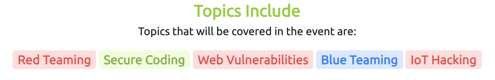

# Advent of Cyber 2022

### Short summary of the story

Ah, the holiday season is close again! You might not feel it yet, but way up north, Elf McSkidy is already busy making sure you get your presents this year. As she walked through the yard of Santa’s workshop this morning, a cup of hot chocolate in her hands, everything seemed to be going great! Gifts getting wrapped, reindeer exercising on treadmills, and Santa’s sleigh being polished, the whole place was just teeming with elf activity.

When McSkidy entered the office, she immediately noticed that something was, in fact, out of order. A big, dark, half-frosted card was just lying on her desk! Who placed it there? How did they get into the locked Security Operations Centre (SOC) room? What did they want from Best Festival Company’s Chief Information Security Officer?!

Not having to think twice about it, McSkidy slammed the big “ALARM” button and yelled: “Security staff! All hands on deck. We’ve got an incident!”

### Prizes

### Topics that are included this year

